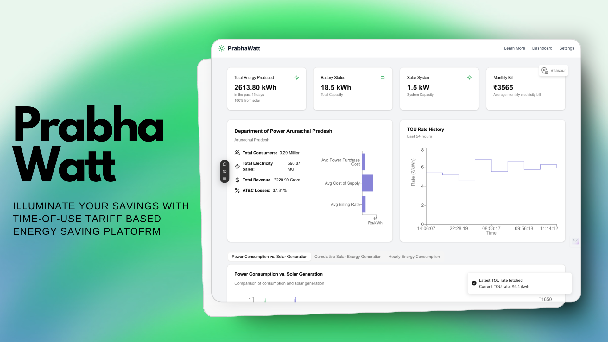

# PrabhaWatt - Solar Energy Optimization Platform

PrabhaWatt is an intelligent solar energy optimization platform designed to revolutionize how users manage and maximize their solar energy usage. By combining real-time monitoring, advanced analytics, and machine learning, we help users reduce electricity bills while contributing to a sustainable future.

**[Live Demo](https://prabhawatt.vercel.app/)** | 📊 **[Sample Energy Data](./assets/Energy%20data.csv)**

## 📑 Table of Contents

## Features

- **Real-Time Monitoring**

  - Live energy consumption tracking
  - Dynamic tariff rate updates
  - Solar generation monitoring

- **Smart Analytics**

  - Machine learning-powered consumption forecasting
  - Usage pattern analysis
  - Cost optimization recommendations

- **Energy Management**

  - Intelligent load scheduling
  - Solar energy utilization optimization
  - Automated device control

- **Financial Tools**

  - Cost-benefit analysis
  - ROI calculator
  - Bill prediction

- **User Experience**
  - Responsive web interface
  - Real-time notifications
  - Custom alerts and reminders

## Technology Stack

- **Frontend**: Next.js, TailwindCSS, ShadcnUI
- **Backend**: Next.js API Routes, Node.js, Firebase
- **ML/Analytics**: Groq, Firebase Analytics
- **Database**: Firebase
- **APIs**: RESTful architecture

## Team Details

This project was developed during a 24hour hackathon called HackCBS. More about the hackathon can be found [here](https://hackcbs.tech/).